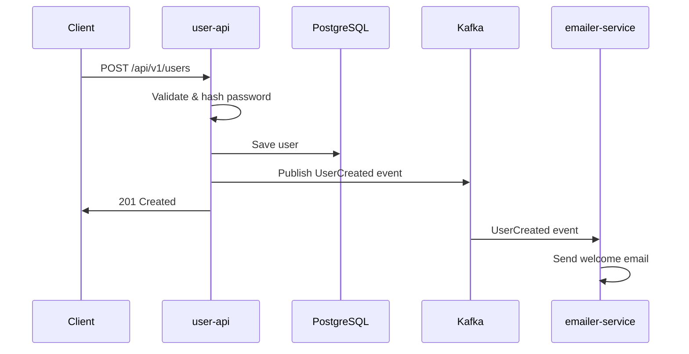

# Event-Driven Architecture with Go

A complete microservices project demonstrating Event-Driven Architecture (EDA) using Go, Kafka, and PostgreSQL.

## 🏗️ Architecture Overview

This project implements a user registration flow using event-driven architecture with two independent microservices:

### Services

1. **`user-api`** (Producer)
   - Public-facing REST API for user registration
   - Saves users to PostgreSQL database
   - Publishes `UserCreated` events to Kafka
   - Implements idempotency and secure password hashing

2. **`emailer-service`** (Consumer)  
   - Background worker service
   - Consumes `UserCreated` events from Kafka
   - Simulates sending welcome emails
   - Handles retries and idempotent processing

### Event Flow



## 🚀 Quick Start

### Prerequisites

- Docker and Docker Compose
- Go 1.25+ (for local development)
- Make (optional, for convenience commands)

### Running with Docker

```bash
# Start all services
make docker-up

# Or manually
docker-compose up -d
```

### Running locally

```bash
# Install dependencies
make deps

# Build services
make build

# Start infrastructure only
docker-compose up -d postgres kafka zookeeper

# Run services locally
make run-user-api    # Terminal 1
make run-emailer     # Terminal 2
```

## 🧪 Testing

### Unit Tests

```bash
# Run unit tests
make test-unit

# Run all tests with coverage
make test
```

### Manual Testing

```bash
# Create a test user
make create-user

# Or manually with curl
curl -X POST http://localhost:8080/api/v1/users \
  -H "Content-Type: application/json" \
  -d '{"email":"test@example.com","password":"password123"}'
```

## 📚 API Documentation

### User API Endpoints

#### Create User
- **POST** `/api/v1/users`
- **Request Body:**
  ```json
  {
    "email": "user@example.com",
    "password": "password123"
  }
  ```
- **Response (201):**
  ```json
  {
    "id": "uuid",
    "email": "user@example.com", 
    "created_at": "2024-01-01T00:00:00Z"
  }
  ```

#### Health Check
- **GET** `/api/v1/health`
- **Response (200):**
  ```json
  {
    "status": "healthy",
    "service": "user-api"
  }
  ```

## 🏛️ Project Structure

```
├── user-api/                 # User registration service
│   ├── cmd/main.go           # Application entry point
│   ├── internal/
│   │   ├── handler/          # HTTP handlers
│   │   ├── service/          # Business logic
│   │   └── repository/       # Data access layer
│   ├── pkg/config/           # Configuration
│   └── Dockerfile
├── emailer-service/          # Email notification service  
│   ├── cmd/main.go           # Application entry point
│   ├── internal/
│   │   ├── processor/        # Event processing
│   │   └── service/          # Email business logic
│   ├── pkg/config/           # Configuration
│   └── Dockerfile
├── shared/                   # Shared libraries
│   └── pkg/
│       ├── events/           # Event definitions
│       ├── models/           # Data models
│       ├── kafka/            # Kafka utilities
│       └── database/         # Database utilities
├── docker-compose.yml        # Infrastructure setup
└── Makefile                  # Build automation
```

## 🛠️ Technology Stack

- **Language:** Go 1.25
- **Web Framework:** Gin
- **Database:** PostgreSQL 15 Alpine
- **Message Broker:** Apache Kafka
- **Database Driver:** sqlx + pq
- **Kafka Client:** segmentio/kafka-go
- **Password Hashing:** bcrypt
- **Testing:** testify
- **Containerization:** Docker & Docker Compose

## 🔧 Configuration

Configuration is handled via environment variables:

### User API
- `SERVER_PORT` (default: 8080)
- `DB_HOST` (default: localhost)
- `DB_PORT` (default: 5432)  
- `DB_USER` (default: postgres)
- `DB_PASSWORD` (default: postgres)
- `DB_NAME` (default: userdb)
- `KAFKA_BROKERS` (default: localhost:9092)
- `KAFKA_TOPIC` (default: users_topic)

### Emailer Service
- `KAFKA_BROKERS` (default: localhost:9092)
- `KAFKA_TOPIC` (default: users_topic)
- `KAFKA_GROUP_ID` (default: emailer-service)

## 🔒 Security Features

- **Password Hashing:** Uses bcrypt with salt
- **Input Validation:** Request validation with Gin binding
- **SQL Injection Prevention:** Parameterized queries with sqlx
- **Idempotency:** Prevents duplicate user registration

## 🔄 Reliability Features

- **Event Replay:** Kafka provides event replay capability
- **Retry Logic:** Exponential backoff for failed event processing
- **Idempotent Processing:** Events can be processed multiple times safely
- **Health Checks:** Docker health checks for all services
- **Graceful Shutdown:** Proper cleanup on SIGTERM/SIGINT

## 🧪 Testing Strategy

### Unit Tests
- **Service Layer Testing:** Business logic tested in isolation
- **Mock Dependencies:** Repository and Kafka producer mocked
- **Test Coverage:** Password hashing, validation, error handling
- **Located:** `user-api/internal/service/user_service_test.go`

### Key Test Cases
- ✅ Successful user creation
- ✅ Duplicate user prevention (idempotency)
- ✅ Input validation (email, password requirements)
- ✅ Password hashing verification
- ✅ Error handling for repository failures
- ✅ Event publishing resilience

## 📈 Monitoring & Observability

- **Structured Logging:** JSON logs with correlation IDs
- **Health Endpoints:** Service health monitoring
- **Event Tracing:** Event processing visibility
- **Retry Metrics:** Failure and retry statistics

## 🚀 Deployment

### Docker Deployment
```bash
# Production build
docker-compose -f docker-compose.yml up -d

# Scale emailer service
docker-compose up -d --scale emailer-service=3
```

### Development Commands
```bash
make help           # Show all available commands
make build          # Build all services
make test           # Run tests with coverage
make docker-build   # Build Docker images
make docker-up      # Start all services
make docker-logs    # View logs
make clean          # Clean build artifacts
```

## 🤝 Contributing

1. Fork the repository
2. Create a feature branch
3. Add tests for new functionality
4. Ensure all tests pass
5. Submit a pull request

## 📄 License

This project is licensed under the MIT License.

---

**Built with ❤️ using Go and Event-Driven Architecture principles**