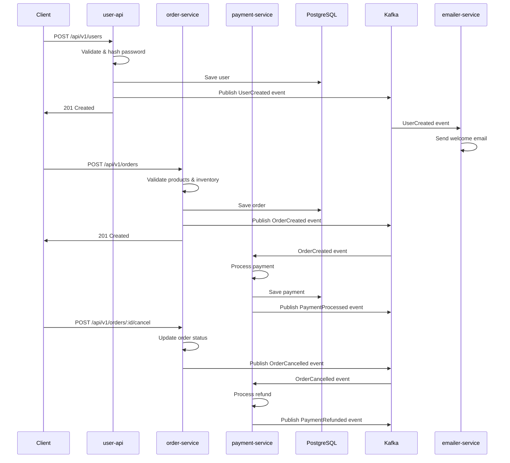

# Event-Driven Architecture with Go

An enterprise-grade microservices platform demonstrating advanced Event-Driven Architecture (EDA) patterns using Go, Kafka, and PostgreSQL.

## 🏗️ Architecture Overview

This project implements a comprehensive e-commerce platform using event-driven architecture with four independent microservices, showcasing complex business workflows, payment processing, and multi-channel notifications.

### Services

1. **`user-api`** (Port 8080)
   - User registration and management
   - Secure password hashing with bcrypt
   - Publishes `UserCreated` and `UserUpdated` events
   - Implements idempotency and request validation

2. **`order-service`** (Port 8081)
   - Complete order lifecycle management
   - Product inventory validation and management
   - Order status state machine with transition validation
   - Publishes `OrderCreated`, `OrderStatusUpdated`, and `OrderCancelled` events
   - Complex business logic with cancellation rules

3. **`payment-service`** (Port 8082)
   - Payment processing with retry mechanisms
   - Mock payment gateway simulation (90% success rate)
   - Payment state machine with automatic retries
   - Publishes `PaymentProcessed`, `PaymentFailed`, and `PaymentRefunded` events
   - Automated refund processing for cancelled orders

4. **`emailer-service`** (Background Worker)
   - Multi-event consumer for user and order notifications
   - Idempotent email processing
   - Welcome emails for new users
   - Order confirmation and status update notifications

### Enhanced Event System

- **Correlation IDs** for distributed tracing
- **Event Metadata** with timestamps, versions, and attributes
- **Event Versioning** for schema evolution
- **Event Envelope Pattern** for message routing
- **Idempotent Processing** across all consumers

### Complex Event Flows



## 🚀 Quick Start

### Prerequisites

- Docker and Docker Compose
- Go 1.25+ (for local development)
- Make (optional, for convenience commands)

### Running with Docker

```bash
# Start all services
make docker-up

# Or manually
docker-compose up -d
```

### Running locally

```bash
# Install dependencies
make deps

# Build services
make build

# Start infrastructure only
docker-compose up -d postgres kafka zookeeper

# Run services locally (each in separate terminal)
make run-user-api         # Terminal 1 - Port 8080
make run-order-service    # Terminal 2 - Port 8081  
make run-payment-service  # Terminal 3 - Port 8082
make run-emailer         # Terminal 4 - Background worker
```

### Testing the APIs

```bash
# Check service health
make health-check

# Create a user
make create-user

# Create an order (triggers automatic payment processing)
make create-order

# Manual payment processing
make process-payment

# Or test manually with curl
curl -X POST http://localhost:8080/api/v1/users \
  -H "Content-Type: application/json" \
  -d '{"email":"john@example.com","password":"password123"}'

curl -X POST http://localhost:8081/api/v1/orders \
  -H "Content-Type: application/json" \
  -d '{
    "user_id": "user-123",
    "items": [{"product_id": "prod-1", "quantity": 2}],
    "currency": "USD",
    "payment_method": "credit_card",
    "shipping_address": {
      "street": "123 Main St",
      "city": "New York", 
      "state": "NY",
      "postal_code": "10001",
      "country": "USA"
    },
    "billing_address": {
      "street": "123 Main St",
      "city": "New York",
      "state": "NY", 
      "postal_code": "10001",
      "country": "USA"
    }
  }'
```

## 🧪 Testing

### Unit Tests

```bash
# Run unit tests
make test-unit

# Run all tests with coverage
make test
```

### Manual Testing

```bash
# Create a test user
make create-user

# Or manually with curl
curl -X POST http://localhost:8080/api/v1/users \
  -H "Content-Type: application/json" \
  -d '{"email":"test@example.com","password":"password123"}'
```

## 📚 API Documentation

### User API (Port 8080)

#### Create User
- **POST** `/api/v1/users`
- **Request Body:**
  ```json
  {
    "email": "user@example.com",
    "password": "password123"
  }
  ```

#### Health Check
- **GET** `/api/v1/health`

### Order Service API (Port 8081)

#### Create Order
- **POST** `/api/v1/orders`
- **Request Body:**
  ```json
  {
    "user_id": "user-123",
    "items": [
      {
        "product_id": "prod-1",
        "quantity": 2
      }
    ],
    "currency": "USD",
    "payment_method": "credit_card",
    "shipping_address": {
      "street": "123 Main St",
      "city": "New York",
      "state": "NY",
      "postal_code": "10001",
      "country": "USA"
    },
    "billing_address": {
      "street": "123 Main St", 
      "city": "New York",
      "state": "NY",
      "postal_code": "10001",
      "country": "USA"
    }
  }
  ```

#### Get Order
- **GET** `/api/v1/orders/{id}`

#### Update Order Status
- **PUT** `/api/v1/orders/{id}/status`
- **Request Body:**
  ```json
  {
    "status": "confirmed",
    "notes": "Order confirmed by customer service"
  }
  ```

#### Get User Orders
- **GET** `/api/v1/users/{userId}/orders?limit=10&offset=0`

#### Cancel Order
- **POST** `/api/v1/users/{userId}/orders/{id}/cancel`
- **Request Body:**
  ```json
  {
    "reason": "Customer requested cancellation"
  }
  ```

### Payment Service API (Port 8082)

#### Process Payment
- **POST** `/api/v1/payments`
- **Request Body:**
  ```json
  {
    "order_id": "order-123",
    "payment_method": "credit_card",
    "amount": 1299.99,
    "currency": "USD"
  }
  ```

#### Get Payment
- **GET** `/api/v1/payments/{id}`

#### Get Payment by Order
- **GET** `/api/v1/orders/{orderId}/payment`

#### Refund Payment
- **POST** `/api/v1/payments/{id}/refund`
- **Request Body:**
  ```json
  {
    "amount": 1299.99,
    "reason": "Order cancelled by customer"
  }
  ```

#### Retry Pending Payments
- **POST** `/api/v1/payments/retry`

### Available Products (Mock Data)

The system includes mock products for testing:

- **prod-1**: Laptop ($1299.99)
- **prod-2**: Wireless Mouse ($29.99)  
- **prod-3**: Keyboard ($89.99)
- **prod-4**: Out of Stock Item ($99.99) - Will fail orders

## 🏛️ Project Structure

```
├── user-api/                 # User registration & management service
│   ├── cmd/main.go           # Application entry point
│   ├── internal/
│   │   ├── handler/          # HTTP handlers
│   │   ├── service/          # Business logic
│   │   └── repository/       # Data access layer
│   ├── pkg/config/           # Configuration
│   └── Dockerfile
├── order-service/            # Order management service
│   ├── cmd/main.go           # Application entry point
│   ├── internal/
│   │   ├── handler/          # HTTP handlers
│   │   ├── service/          # Business logic
│   │   └── repository/       # Data access layer
│   ├── pkg/config/           # Configuration
│   └── Dockerfile
├── payment-service/          # Payment processing service
│   ├── cmd/main.go           # Application entry point
│   ├── internal/
│   │   ├── handler/          # HTTP handlers
│   │   ├── service/          # Business logic
│   │   ├── repository/       # Data access layer
│   │   └── processor/        # Event processing
│   ├── pkg/config/           # Configuration
│   └── Dockerfile
├── emailer-service/          # Email notification service  
│   ├── cmd/main.go           # Application entry point
│   ├── internal/
│   │   ├── processor/        # Event processing
│   │   └── service/          # Email business logic
│   ├── pkg/config/           # Configuration
│   └── Dockerfile
├── shared/                   # Shared libraries
│   └── pkg/
│       ├── events/           # Event definitions with metadata
│       ├── models/           # Domain models (User, Order, Payment, etc.)
│       ├── kafka/            # Kafka utilities
│       └── database/         # Database utilities & schema
├── docker-compose.yml        # Infrastructure setup
└── Makefile                  # Build automation
```

## 🛠️ Technology Stack

- **Language:** Go 1.25
- **Web Framework:** Gin
- **Database:** PostgreSQL 15 Alpine
- **Message Broker:** Apache Kafka
- **Database Driver:** sqlx + pq
- **Kafka Client:** segmentio/kafka-go
- **Password Hashing:** bcrypt
- **Testing:** testify
- **Containerization:** Docker & Docker Compose

## 🔧 Configuration

Configuration is handled via environment variables:

### User API
- `SERVER_PORT` (default: 8080)
- `DB_HOST` (default: localhost)
- `DB_PORT` (default: 5432)  
- `DB_USER` (default: postgres)
- `DB_PASSWORD` (default: postgres)
- `DB_NAME` (default: userdb)
- `KAFKA_BROKERS` (default: localhost:9092)
- `KAFKA_TOPIC` (default: users_topic)

### Order Service
- `SERVER_PORT` (default: 8081)
- `DB_HOST` (default: localhost)
- `DB_PORT` (default: 5432)
- `DB_USER` (default: postgres)
- `DB_PASSWORD` (default: postgres)
- `DB_NAME` (default: orderdb)
- `KAFKA_BROKERS` (default: localhost:9092)
- `KAFKA_TOPIC` (default: orders_topic)

### Payment Service
- `SERVER_PORT` (default: 8082)
- `DB_HOST` (default: localhost)
- `DB_PORT` (default: 5432)
- `DB_USER` (default: postgres)
- `DB_PASSWORD` (default: postgres)
- `DB_NAME` (default: paymentdb)
- `KAFKA_BROKERS` (default: localhost:9092)
- `KAFKA_ORDERS_TOPIC` (default: orders_topic)
- `KAFKA_PAYMENTS_TOPIC` (default: payments_topic)
- `KAFKA_GROUP_ID` (default: payment-service)

### Emailer Service
- `KAFKA_BROKERS` (default: localhost:9092)
- `KAFKA_TOPIC` (default: users_topic)
- `KAFKA_GROUP_ID` (default: emailer-service)

## 🔒 Security Features

- **Password Hashing:** Uses bcrypt with salt for secure user authentication
- **Input Validation:** Comprehensive request validation with Gin binding
- **SQL Injection Prevention:** Parameterized queries with sqlx
- **Idempotency:** Prevents duplicate operations across all services
- **Event Correlation:** Distributed tracing with correlation IDs

## 🔄 Reliability Features

- **Event Replay:** Kafka provides event replay capability for fault recovery
- **Exponential Backoff:** Intelligent retry logic for failed operations
- **Circuit Breaker Pattern:** Payment gateway failures handled gracefully  
- **Idempotent Processing:** Events can be processed multiple times safely
- **Health Checks:** Docker health checks for all services
- **Graceful Shutdown:** Proper cleanup on SIGTERM/SIGINT
- **Payment Retry Mechanism:** Automatic retry for failed payments with configurable limits
- **Order State Machine:** Strict validation of order status transitions
- **Saga Pattern:** Distributed transaction handling for order cancellation and refunds

## 🏗️ Advanced Patterns Implemented

### Event Sourcing & CQRS
- **Event Metadata:** Rich event context with correlation IDs, timestamps, and user tracking
- **Event Versioning:** Schema evolution support for backward compatibility
- **Event Envelope Pattern:** Standardized message routing and processing

### Microservices Patterns
- **Database per Service:** Each service manages its own data
- **Event-Driven Communication:** Loose coupling through asynchronous messaging
- **Saga Pattern:** Complex business processes spanning multiple services
- **Outbox Pattern:** Reliable event publishing (implicitly implemented)

### Resilience Patterns
- **Retry with Exponential Backoff:** Payment processing and event handling
- **Timeout Handling:** Configurable timeouts for external service calls
- **Dead Letter Queue Pattern:** Failed event processing (Kafka retention)
- **Health Check Pattern:** Service availability monitoring

## 🧪 Testing Strategy

### Unit Tests
- **Service Layer Testing:** Business logic tested in isolation
- **Mock Dependencies:** Repository and Kafka producer mocked
- **Test Coverage:** Password hashing, validation, error handling
- **Located:** `user-api/internal/service/user_service_test.go`

### Key Test Cases
- ✅ Successful user creation
- ✅ Duplicate user prevention (idempotency)
- ✅ Input validation (email, password requirements)
- ✅ Password hashing verification
- ✅ Error handling for repository failures
- ✅ Event publishing resilience

## 📈 Monitoring & Observability

- **Structured Logging:** JSON logs with correlation IDs
- **Health Endpoints:** Service health monitoring
- **Event Tracing:** Event processing visibility
- **Retry Metrics:** Failure and retry statistics

## 🚀 Deployment

### Docker Deployment
```bash
# Production build
docker-compose -f docker-compose.yml up -d

# Scale emailer service
docker-compose up -d --scale emailer-service=3
```

### Development Commands
```bash
make help           # Show all available commands
make build          # Build all services
make test           # Run tests with coverage
make docker-build   # Build Docker images
make docker-up      # Start all services
make docker-logs    # View logs
make clean          # Clean build artifacts
```

## 🤝 Contributing

1. Fork the repository
2. Create a feature branch
3. Add tests for new functionality
4. Ensure all tests pass
5. Submit a pull request

## 📄 License

This project is licensed under the MIT License.

---

**Built with ❤️ using Go and Event-Driven Architecture principles**